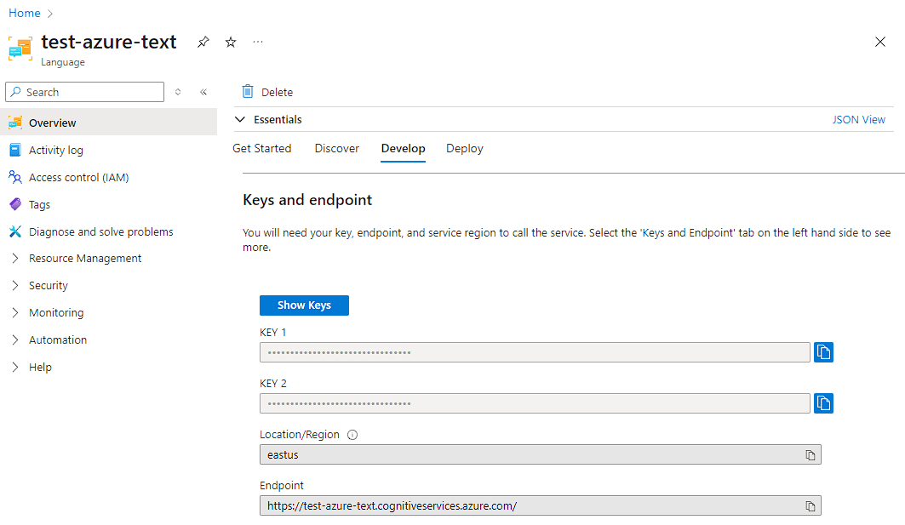
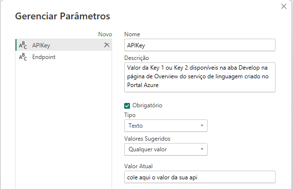
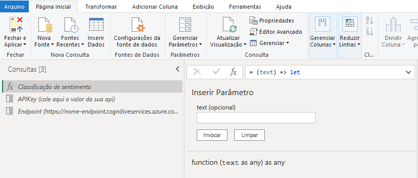
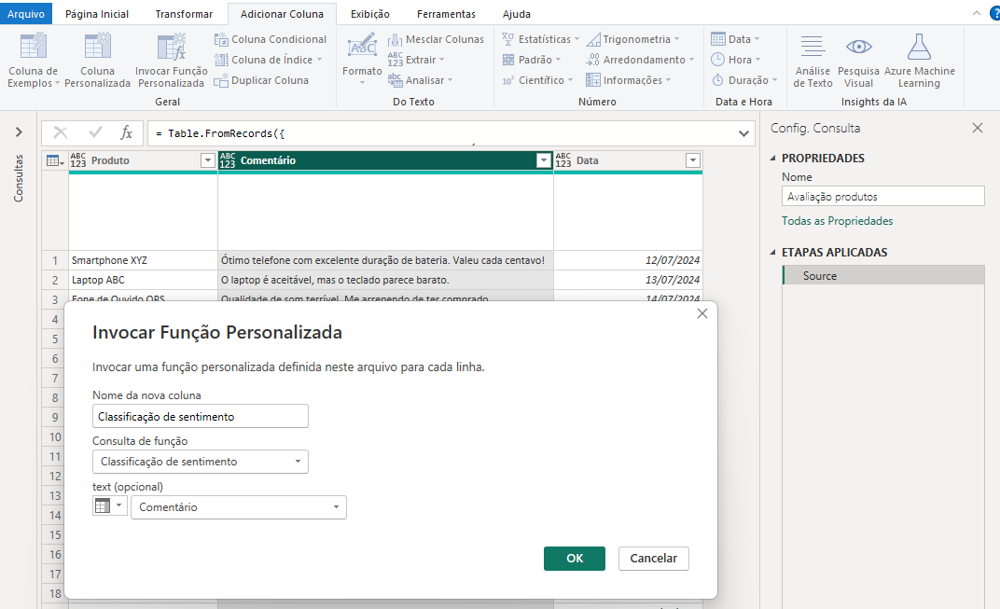
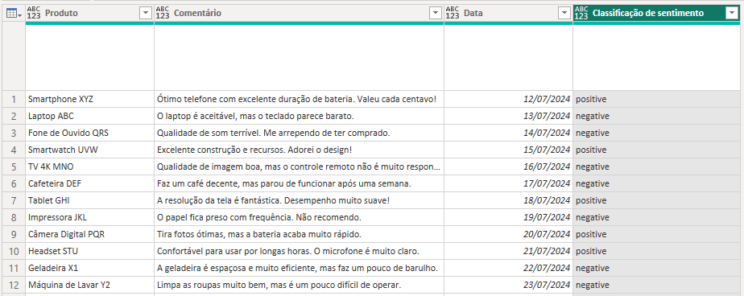

# Análise de sentimentos no Power BI com o Azure AI Language

O Power BI fornece um recurso de Análise de Texto nativo, mas para utilizar o recurso é necessário possuir uma capacidade Premium.

Uma alternativa gratuita para testes e pequenos projetos é utilizar o Azure AI Language, que é um serviço de análise de texto disponível no Azure. O recurso possui uma instância gratuita que permite a análise de até 5.000 registros por mês.

Dentro do Power BI é possível fazer requisições ao serviço através de uma simples função no Power Query.

## Criando o serviço no Azure

Acesse o portal do Azure e crie um recurso do tipo "Language service". 


Na página para selecionar features adicionais, mantenha selecionado apenas as features default e avance. Defina um grupo de recurso, região e um nome para o recurso. No plano de preço selecione a camada gratuita.



Depois de criado, acesse o recurso e na página de Overview navegue para a aba Develop para ter acesso a chave e endpoint que vão ser necessários para configurar a função no Power BI.

## Configurando a função no Power BI

Em um arquivo do Power BI, clique em **Obter dados** e em **Consulta em branco**, depois clique em **Editor avançado** e cole o código abaixo. Clique em **Concluído** e renomeie a função para `Classificação de sentimento`.

```m
// Retorna a classificação de sentimento para um texto, por exemplo, positive, negative ou neutral.
(text) => let
    apikey = APIKey,
    endpoint = Endpoint & "/text/analytics/v3.1/sentiment",
    jsontext = Text.FromBinary(Json.FromValue(Text.Start(Text.Trim(text), 5000))),
    jsonbody = "{ documents: [ { language: ""pt-br"", id: ""0"", text: " & jsontext & " } ] }",
    bytesbody = Text.ToBinary(jsonbody),
    headers = [#"Ocp-Apim-Subscription-Key" = apikey],
    bytesresp = Web.Contents(endpoint, [Headers=headers, Content=bytesbody]),
    jsonresp = Json.Document(bytesresp),
    sentiment   = jsonresp[documents]{0}[sentiment] 
    in sentiment
```

Para corrigir o erro que aparece na função que acabamos de criar, ainda no Power Query crie dois parâmetros com o nome de `APIKey` e `Endpoint`, defina os valores obtidos no portal do Azure para cada um deles.



O resultado que aparece no seu Power Query deve ser algo parecido com a imagem abaixo.



## Utilizando a função

Agora que a função está configurada, você pode utilizá-la em qualquer tabela do Power BI. Basta clicar no botão **Invocar função personalizada** na aba **Adicionar coluna**, dar um nome para nova coluna, escolher a função que acabamos de criar e definir no parametro `text` a coluna que contém o texto que você deseja analisar.



Se for solicitado que edite as credencias, selecione a opção **Anônimo** e clique em **Conectar**. Como resultado uma nova coluna será adicionada na tabela com a classificação de sentimento para cada texto.



O arquivo **Azure AI Language análise de sentimentos.pbix** contém um exemplo de utilização da função. Se preferir usar o arquivo como base, basta alterar os parâmetros `APIKey` e `Endpoint` com os valores obtidos no portal do Azure antes de atualizar o conjunto de dados.